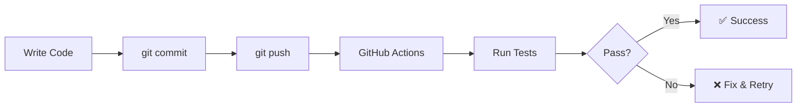

# Hello OpenClaw 🤖

My first OpenClaw project - learning Node.js, Git, GitHub, and CI/CD!

## 🎯 Project Goals

- ✅ Learn OpenClaw project structure
- ✅ Practice Git version control
- ✅ Understand GitHub integration
- ✅ Build CI/CD pipeline with GitHub Actions

## 🚀 Quick Start

```bash
# Navigate to project
cd /home/steven/ws/hello-openclaw

# Run the application
npm start

# Run tests
npm test
```

## 📁 Project Structure

```
hello-openclaw/
├── .github/
│   └── workflows/
│       └── ci.yml         # CI/CD pipeline
├── src/
│   └── index.js           # Main application
├── tests/
│   └── index.test.js      # Test suite
├── .gitignore             # Git ignore rules
├── package.json           # Node.js configuration
└── README.md              # This file
```

## 🔄 CI/CD Flow



## 📚 What I Learned

### Technical Skills
- [ ] Node.js project setup
- [ ] Git commands (commit, push, pull)
- [ ] GitHub repository management
- [ ] GitHub Actions workflow
- [ ] Writing tests

### English Skills
- [ ] Read technical documentation
- [ ] Write commit messages
- [ ] Understand CI/CD logs
- [ ] Discuss code in English

## 🎓 Next Steps

After completing this project:
1. Add more features to the app
2. Learn about branches and pull requests
3. Add deployment to the CI/CD pipeline
4. Move to Project 2: Quick Notes Agent

## 👤 Author

**yangsheng991** - Learning OpenClaw through projects!

---

_Started: 2026-02-28_
